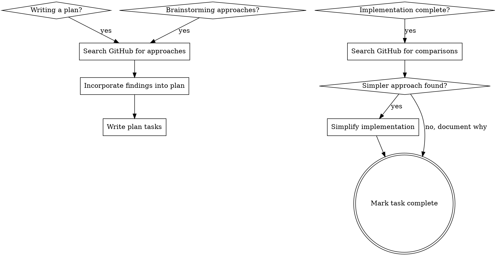

# Benchmarking Implementations

## Overview

Search GitHub for how established projects solve the same problem you're working on. Do this **before** finalizing a plan and **after** finishing implementation.

**Core principle:** Your knowledge is a starting point, not a ceiling. Five minutes of searching almost always reveals a simpler approach, a battle-tested library, or a pattern you hadn't considered.

## When to Search

**MUST search at three points:**

1. **Brainstorming** — before proposing 2-3 approaches, search for how mature projects solve the same problem. This is where skipping is most costly: you lock in an approach based on knowledge alone.
2. **Planning** — before writing implementation tasks, confirm the chosen approach against real-world examples
3. **Post-implementation** — after code works and tests pass, search to see if the solution could be simpler



## How to Search

1. **Formulate 2-3 queries** from the problem domain (see Quick Reference for `gh` syntax)
2. **Execute them** — listing queries you "would" run does not count. Run the commands, read output, adjust if results are empty. Nothing useful? Fine — document it and move on.
3. **Read the top 2-3 results** — look for simpler data models, cleaner APIs, edge cases you missed, libraries that already do this
4. **Document findings** — during planning: note in the plan ("Approach informed by [repo]'s pattern"). Post-implementation: simplify or document why your approach is better.

## Common Rationalizations

| Excuse | Reality |
|---|---|
| "I already know how to do this" | You know *a* way. Search reveals whether it's the *best* way. |
| "The design space is narrow" | Narrow design spaces still have better and worse implementations. Search takes 5 minutes. |
| "Searching is for the design phase" | Post-implementation search catches over-engineering and missed libraries. Both phases matter. |
| "Time pressure — developer is waiting" | 5 minutes of searching saves hours of rework. Shipping a worse solution is not faster. |
| "Swapping to a library is too disruptive" | You're not required to swap. You're required to *know what exists* and make an informed choice. |
| "I'll search if I get stuck" | By then you've sunk time into your approach. Search early, when you can still change direction cheaply. |
| "My implementation already works" | Working != optimal. The point is to find *simplifications*, not prove it's broken. |
| "I know what I'd find" | Then prove it — run the search. If you're right, it takes 30 seconds. If you're wrong, you just saved hours. |
| "I'll list the searches I would run" | Listing queries is not searching. Execute them. Read results. Then decide. |
| "I'm following [brainstorming/other skill] which doesn't mention searching" | No other skill overrides this one. Benchmarking applies at every design decision point regardless of what other process you're following. |
| "I explored the codebase — that's equivalent" | Searching your own codebase is not benchmarking. You need external evidence from established projects. |

## Red Flags — STOP and Search

- **About to propose 2-3 approaches during brainstorming without searching GitHub first**
- About to write a plan without checking how others solved it
- About to mark implementation complete without comparing against existing approaches
- Thinking "I know this domain well enough"
- Following another skill (brainstorming, writing-plans) and assuming it covers search — it doesn't
- Feeling time pressure as a reason to skip
- Rolling your own when a library might exist
- Writing 50+ lines for something that might be a one-liner with the right tool
- Listing search queries without executing them
- Saying "I would search for X" instead of actually searching

## Quick Reference

```bash
gh search repos "<problem>" --language <lang> --sort stars --limit 5
gh search code "<pattern>" --language <lang> --limit 10
gh search code "<pattern>" --repo owner/repo --limit 10
gh api repos/owner/repo/contents/path/to/file | jq -r '.content' | base64 -d
```
