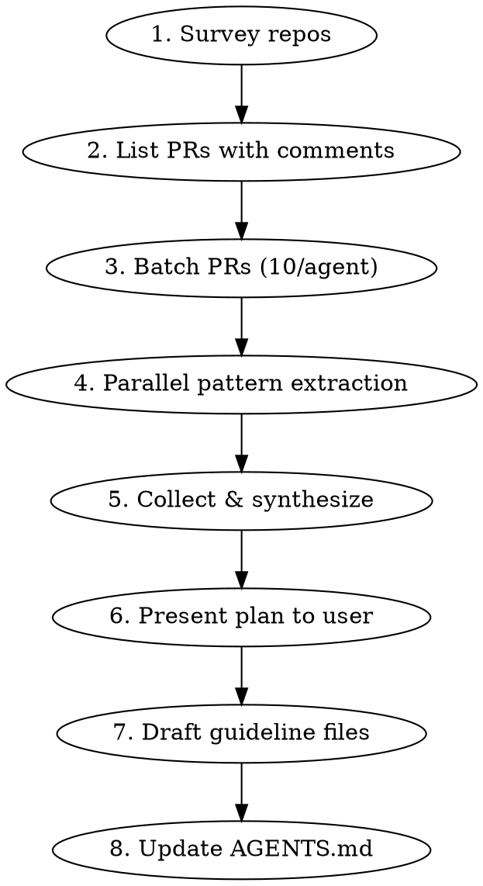

# Mining PR Guidelines

Extract coding guidelines from historical PR review comments. Dispatches parallel subagents to review batches of PRs, counts recurring patterns, and produces guideline files.

## When to Use

- Creating a `guidelines/` folder for a repo that has none
- Bootstrapping conventions from team review history
- Mirroring an existing repo's guidelines format in a new repo

## Prerequisites

- `gh` CLI authenticated with repo access
- Target repo has merged PRs with review comments
- (Optional) Source repo with existing guidelines format to mirror

## Workflow



### Step 1: Survey Repos

Dispatch two parallel research subagents:

**Target repo subagent:**
- Top-level directory structure
- Existing guidelines, AGENTS.md, CLAUDE.md, coding standards
- Key domains/service areas from folder structure
- Tech stack (language, framework, build system)

**Source repo subagent** (if mirroring):
- List all guideline files and their paths
- Organizational pattern (by concern vs by service)
- Format: frontmatter fields, section structure, example style
- Key themes covered

### Step 2: List PRs with Comments

Dispatch a shell subagent:

```bash
cd <repo-path>
gh pr list --state merged --limit 200 \
  --json number,title,comments,createdAt,mergedAt \
  | jq '[.[] | select(.comments > 0)] | sort_by(-.comments)'
```

For repos with many PRs, also fetch review comments (inline code comments):

```bash
gh api repos/<org>/<repo>/pulls/<number>/comments --paginate \
  --jq 'length'
```

Return: list of PR numbers with titles, comment counts, sorted by most comments.

### Step 3: Batch PRs

Divide PRs into batches of **10 per subagent**. Prioritize PRs with more comments. Use fast models for extraction.

### Step 4: Parallel Pattern Extraction

Dispatch one subagent per batch. Use the extraction prompt below.

Each subagent returns a structured list of patterns with counts and evidence.

### Step 5: Collect & Synthesize

Dispatch one synthesis subagent that receives all pattern lists. It:
1. Merges duplicates and near-duplicates
2. Totals counts across batches
3. Ranks by frequency
4. Groups into candidate guideline topics

### Step 6: Present Plan to User

Show the user:
- Ranked pattern groups with counts
- Proposed guideline file names (GL### format)
- Domain/concern allocation
- Wait for approval before writing files

### Step 7: Draft Guideline Files

Dispatch parallel subagents (one per guideline file) to write each file using the guideline file format below.

### Step 8: Update AGENTS.md

Add a small section referencing the guidelines folder:

```markdown
## Coding Guidelines

See `guidelines/` for detailed coding standards extracted from PR review history.
```

## Extraction Prompt Template

```
Analyze these PRs from the <org>/<repo> repository. For each PR, read the diff
and ALL review comments. Focus on what reviewers asked to change and why.

PRs to analyze: <list of PR numbers>
Repo path: <path>

For EACH PR:
1. Run: gh pr diff <number> (in the repo directory)
2. Run: gh api repos/<org>/<repo>/pulls/<number>/comments --paginate
3. Also: gh api repos/<org>/<repo>/pulls/<number>/reviews --paginate
4. Read the code at the time of each comment and how it was resolved

Extract recurring review patterns. A pattern is a rule the reviewer
enforced repeatedly. For each pattern found:
- Name: short descriptive name
- Category: (error-handling | code-style | testing | architecture |
  naming | performance | security | logging | api-design |
  dependency-management | other)
- Count: how many times this pattern appeared across these PRs
- Evidence: 1-2 concrete examples (PR number + what was flagged + fix)

Return ONLY a JSON array:
[
  {
    "name": "Use structured logging not f-strings",
    "category": "logging",
    "count": 3,
    "evidence": [
      {"pr": 123, "flagged": "logger.info(f'Processing {id}')",
       "fix": "logger.info('processing_item', item_id=id)"}
    ]
  }
]
```

## Synthesis Prompt Template

```
You are given pattern lists from <N> subagents who each analyzed 10 PRs
from <org>/<repo>.

<paste all pattern arrays here>

Tasks:
1. Merge patterns that describe the same rule (even if worded differently)
2. Sum counts across batches for merged patterns
3. Rank by total count (descending)
4. Group into guideline topics. Each topic should have 3+ patterns.
   Single-pattern topics should merge into the closest topic.

Proposed topic format: GL###_<snake_case_topic>.md

Return a structured summary:
- For each proposed guideline file:
  - File name
  - Patterns included (with total counts)
  - Brief scope description
- Ungrouped patterns (count < 2) listed separately
```

## Guideline File Format

Mirror this structure for each GL### file:

```markdown
---
date: <YYYY-MM-DD>
author: Cursor Agent
topic: "<Topic Name>"
tags: [guidelines, <relevant>, <tags>]
status: active
source: Synthesized from PR review comments
---

# <Topic Name>

## <Rule Name>

<Explanation — one or two sentences>

\```<language>
# Bad
<anti-pattern from PR evidence>

# Good
<correct pattern from PR resolution>
\```

## <Next Rule>
...
```

Rules for writing guideline content:
- Every rule needs a bad/good code example from actual PR evidence
- Keep explanations to 1-2 sentences — the code examples do the teaching
- Use the dominant language of the target repo for examples
- Group related rules under a single GL file (3-8 rules per file is ideal)

## Model Selection

| Task | Model | Rationale |
|------|-------|-----------|
| PR pattern extraction | fast | Mechanical: read diff + comments, extract patterns |
| Pattern synthesis | standard | Judgment: deduplication and grouping |
| Guideline drafting | standard | Quality: writing clear rules with examples |
| AGENTS.md update | fast | Mechanical: small addition |

## Common Issues

- **Too many small patterns**: Raise the minimum count threshold (default: 2 occurrences)
- **Patterns too vague**: Ask extraction subagents to include concrete code examples, not just descriptions
- **Missing inline comments**: `gh pr view` only shows top-level comments; use `gh api repos/.../pulls/.../comments` for inline review comments
- **Rate limiting**: If gh CLI hits rate limits, reduce batch size or add `--paginate` with delays
