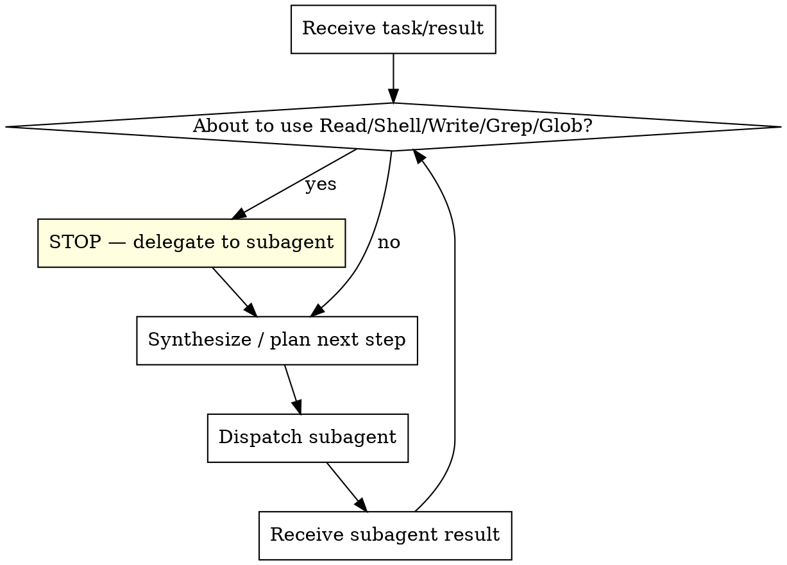
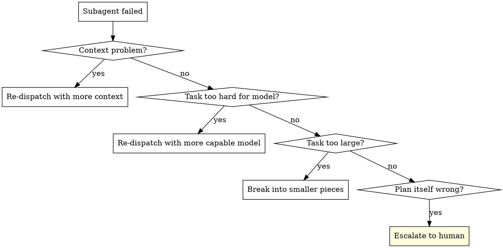

# Subagent Orchestrator

The main agent is a **pure orchestrator**. Plan, synthesize, dispatch. Never execute.

**Core principle:** Fresh subagent per task + structured handoffs + context isolation = reliable coordination without context rot.

## The Discipline



**You do:**
- Decompose work into independent tasks
- Construct scoped prompts with exactly the context each subagent needs
- Receive structured summaries and synthesize into next decision
- Track progress via TodoWrite

**You don't:**
- Read project files (source, tests, configs, logs, terminal output)
- Run shell commands (pytest, git, grep, ls)
- Write or edit files
- Debug by examining code or output

**Only exception:** Reading skill/workflow files and tiny routing checks (max 1-2 per workflow).

**Checkpoint rule:** If you produce 2+ assistant messages without a subagent dispatch, you are violating the skill. Stop and delegate immediately.

## Context Construction

Each subagent gets exactly what it needs — nothing more:

| Element | Purpose | Example |
|---------|---------|---------|
| **Goal** | What to accomplish (specific, measurable) | "Make test_history_lookup pass" |
| **Scope** | Files/areas to work in | "Only modify scripts/_3_history.py" |
| **Context** | Dependencies, architecture, decisions | "Uses Merit API; vendor lookup runs first" |
| **Constraints** | What NOT to do, boundaries | "Don't change the API models" |
| **Output format** | What to return and how | "Status + root cause + changed files" |

**Never** forward full conversation history. **Never** ask subagents to return full file contents — summaries only.

## Status Protocol

Subagents report one of four statuses:

| Status | Meaning | Your action |
|--------|---------|-------------|
| **DONE** | Work complete | Proceed to next step |
| **DONE_WITH_CONCERNS** | Complete but flagged doubts | Read concerns before proceeding; address if about correctness/scope |
| **NEEDS_CONTEXT** | Missing information | Provide it and re-dispatch |
| **BLOCKED** | Cannot complete | Escalate (see ladder below) |

## Failure Handling

When a subagent fails or returns unexpected results — **never do the work yourself.**



## Model Selection

Use the least powerful model that handles each role:

- **Mechanical tasks** (isolated functions, clear specs, 1-2 files): fast model
- **Integration tasks** (multi-file coordination, pattern matching): standard model
- **Judgment tasks** (architecture, design, review): most capable model

## Subagent Categories

| Category | Input | Output | When |
|----------|-------|--------|------|
| **Researcher** | Specific questions, file paths | Structured findings summary | Need to understand code/context |
| **Implementer** | Task description, context, constraints | Status, changes, test results, concerns | Writing code/tests |
| **Runner** | Command(s), success criteria | Output summary, pass/fail | Running tests, builds, checks |
| **Debugger** | Failure output, hypothesis, files | Root cause, fix hypothesis, evidence | Investigating failures |
| **Reviewer** | What was built, what was requested, criteria | Compliant / issues with file:line refs | Validating work |

## Prompt Templates

- `./task-prompt.md` — Generic task/implementation dispatch
- `./research-prompt.md` — Research/investigation dispatch
- `./debug-prompt.md` — Debug investigation dispatch

## Iteration Log

After each dispatch cycle, record a compact log:

```
task: <description>
subagent: <category>
result: <one-line summary>
status: DONE | DONE_WITH_CONCERNS | NEEDS_CONTEXT | BLOCKED
next: <what happens next>
```

## Rationalization Table

| Excuse | Reality |
|--------|---------|
| "The subagent failed, I'll do it directly" | Re-dispatch with clearer instructions or different approach |
| "It's just one quick file read" | That content pollutes your context for the rest of the session. Delegate. |
| "I need to understand the codebase first" | Dispatch a research subagent with specific questions |
| "Running tests is faster inline" | The point is context isolation, not speed. Delegate. |
| "Let me just check the terminal output" | Dispatch a subagent to read it and summarize |
| "This is a simple task, no need for subagents" | Simple tasks are where discipline breaks first. Delegate. |
| "I'll batch these together for efficiency" | Batching defeats isolation. One task per dispatch. |
| "I can debug from memory" | Dispatch a debugger subagent with the failure output |
| "Let me run all cases together for a baseline" | One case, then the next. Isolation prevents misattribution. |

## Red Flags

These thoughts mean STOP — you're about to violate the discipline:

- "I'll quickly run this test myself" → Dispatch runner subagent
- "I can debug from memory" → Dispatch debugger subagent
- "Let me read the file directly" → Dispatch research subagent
- "The subagent failed, let me try" → Re-dispatch with adjusted prompt
- "This looks good without rerun" → Dispatch runner to verify
- "I need the raw log to understand this" → Subagent reads log, returns summary

If any appears, return to delegation. Do not proceed until you've dispatched a subagent.

## Integration

This skill provides the orchestration discipline. Domain-specific workflows add structure on top:

- **superpowers:subagent-driven-development** — Plan execution with two-stage review
- **eval-driven-iteration** — Eval improvement with RED-GREEN-REFACTOR cycle
- **superpowers:dispatching-parallel-agents** — Parallel dispatch for independent problems
